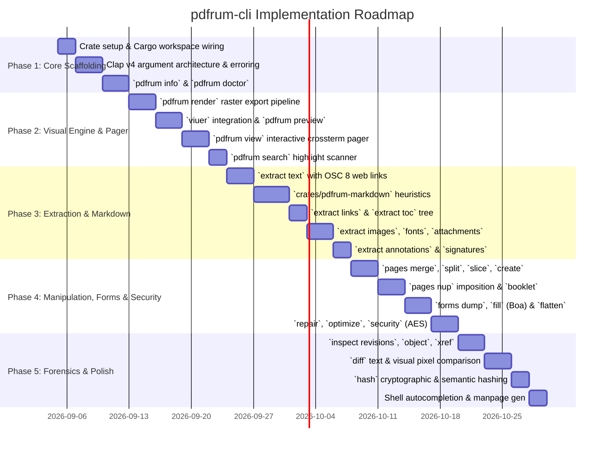

# Design Specification: `pdfrum-cli` — Modern, Terminal-Native PDF Power Tool

**Status:** Scoped 2026-09-04 (§9); PLAN.md M19. Not started.  
**Date:** 2026-09-04  
**Scope:** `crates/pdfrum-cli`, `crates/pdfrum-markdown`, `crates/pdfrum-tool`, `Cargo.toml`, `DEPS.md`  
**Related Documents:** [PLAN.md](file:///home/r13921098/pdfium/pdfrum/PLAN.md), [DEPS.md](file:///home/r13921098/pdfium/pdfrum/DEPS.md), [STYLE.md](file:///home/r13921098/pdfium/pdfrum/STYLE.md), [docs/design/cargo-features-and-backends.md](file:///home/r13921098/pdfium/pdfrum/docs/design/cargo-features-and-backends.md), [docs/design/idiomatic-api.md](file:///home/r13921098/pdfium/pdfrum/docs/design/idiomatic-api.md)  
**Reference Implementations:**  
* MinerU-rs Native Text Heuristics: [`/home/r13921098/MinerU-rs/crates/mineru-pdf/src/text.rs`](file:///home/r13921098/MinerU-rs/crates/mineru-pdf/src/text.rs)  
* MinerU-rs Markdown Block Renderer: [`/home/r13921098/MinerU-rs/crates/mineru-render/src/markdown.rs`](file:///home/r13921098/MinerU-rs/crates/mineru-render/src/markdown.rs)  
* MinerU-rs Document AST Types: [`/home/r13921098/MinerU-rs/crates/mineru-types/src/document.rs`](file:///home/r13921098/MinerU-rs/crates/mineru-types/src/document.rs)

---

## 0. Executive Summary & Vision

The PDF command-line ecosystem is currently bifurcated into two unsatisfactory camps:
1. **Renderers without structural manipulation** (`pdftoppm`, MuPDF `draw`), typically fragmented across dozens of discrete C/C++ binaries with CVE-prone memory models and rigid, unscriptable text output.
2. **Structural manipulators without renderers** (`qpdf`, `pdfcpu`), which can slice, merge, and optimize PDF object graphs but cannot rasterize pages, inspect visual output, or verify graphical layout.

Because `pdfrum` is a full-stack, pure-Rust PDF engine implementing both **Chrome/PDFium fault-tolerant document recovery** and a **multi-backend graphics pipeline** (Vello CPU, tiny-skia, AGG, GPU), it can deliver a unified, memory-safe CLI (`pdfrum`) that excels at both worlds.

This document specifies the architecture, dependencies, command taxonomy, and terminal-native capabilities for **`pdfrum-cli`**:
* **Modern Terminal Experience:** Inline page graphics via Kitty APC, iTerm2 OSC 1337, Sixel, and TrueColor half-blocks (`▀`) via [`viuer`](https://crates.io/crates/viuer); clickable in-terminal hyperlinks via **OSC 8**; colored semantic styling; and responsive Unicode tables via [`comfy-table`](https://crates.io/crates/comfy-table).
* **Developer & Scripting First:** First-class `--json` serialization on all inspection/extraction commands; seamless Unix pipeline integration (`is_terminal()` streaming for stdin/stdout).
* **Strict Oracle Separation:** Preserves [`crates/pdfrum-tool`](file:///home/r13921098/pdfium/pdfrum/crates/pdfrum-tool) for Tier A byte-for-byte conformance diffing against Google's C++ `pdfium_test`, establishing `pdfrum-cli` as the human- and pipeline-facing command-line tool.
* **Pure-Rust & Supply Chain Integrity:** Complies strictly with [DEPS.md](file:///home/r13921098/pdfium/pdfrum/DEPS.md) and [STYLE.md](file:///home/r13921098/pdfium/pdfrum/STYLE.md): zero `-sys` crates, zero C/C++ compilation, and `unsafe_code = "forbid"`.

---

## 1. Architectural Boundary: Oracle Mirror vs. User CLI

### 1.1 The Role of `crates/pdfrum-tool`
As documented in [`crates/pdfrum-tool/Cargo.toml`](file:///home/r13921098/pdfium/pdfrum/crates/pdfrum-tool/Cargo.toml#L48-L53) and [`options.rs`](file:///home/r13921098/pdfium/pdfrum/crates/pdfrum-tool/src/options.rs#L3-L9), `pdfrum-tool` is an internal differential testing harness:
* It parses arguments by hand to replicate C++ `std::stringstream` extraction semantics (`--pages=3-5`).
* It exits with code 0 on malformed input to mirror `pdfium_test`'s exit convention.
* It prints raw unencoded bitmap MD5 hashes (`MD5:<path>:<hash>`) rather than standard file hashes.
* Tier A differential tests in `conformance run` depend on exact string-level stderr/stdout matching.

### 1.2 The Role of `crates/pdfrum-cli`
`pdfrum-cli` is the dedicated, user-facing binary crate (emitting binary `pdfrum`). It is:
* Driven by [`clap`](https://crates.io/crates/clap) v4 (derive API) with shell completions and rich help.
* Designed for human ergonomics (ANSI colors, terminal graphics, progress indicators) and pipeline automation (`--json`, exit code semantics, stdin/stdout piping).
* Completely decoupled from the C++ oracle's historical quirks.

---

## 2. Dependency Audit & Supply Chain Compliance

In accordance with [DEPS.md](file:///home/r13921098/pdfium/pdfrum/DEPS.md), all dependencies must be pure Rust with zero C/C++ build dependencies.

### 2.1 Proposed Manifest for `crates/pdfrum-cli/Cargo.toml`

```toml
[package]
name = "pdfrum-cli"
description = "Modern, terminal-native CLI for the pdfrum PDF engine"
version.workspace = true
edition.workspace = true
license.workspace = true
repository.workspace = true

[[bin]]
name = "pdfrum"
path = "src/main.rs"

[lints]
workspace = true

[features]
# Single default backend: fast, pure-Rust Vello CPU
default = ["vello-cpu", "markdown", "edit", "forms", "codecs-all", "system-fonts"]
vello-cpu = ["pdfrum/vello-cpu"]
markdown = ["dep:pdfrum-markdown"]
edit = ["pdfrum/edit"]
forms = ["pdfrum/forms"]
javascript = ["forms", "pdfrum/javascript"]
codecs-all = ["pdfrum/codecs-all"]
system-fonts = ["pdfrum/system-fonts"]

[dependencies]
# Engine facade & Markdown subsystem
pdfrum.workspace = true
pdfrum-markdown = { workspace = true, optional = true }

# CLI & Argument Parsing (Already in workspace)
clap = { workspace = true, features = ["derive", "env"] }
anstyle = "=1.0.10" # Already in Cargo.lock transitively

# Terminal UI, Pager & Tables
comfy-table = { version = "=7.1.4", default-features = false, features = ["custom_styling"] }
indicatif = { version = "=0.17.11", default-features = false }
crossterm = { version = "=0.28.1", default-features = false }
rpassword = "=7.4.0"

# Terminal Graphics & Imaging
viuer = { version = "=0.11.0", default-features = false }
image = { version = "=0.25.5", default-features = false, features = ["png"] }

# Serialization & Diagnostics
serde = { workspace = true, features = ["derive"] }
serde_json.workspace = true
anyhow.workspace = true
```

### 2.2 Dependency Justification & Audit Table

| Crate | Version | Pure Rust? | `-sys` or `cc`? | Purpose in CLI |
|---|:---:|:---:|:---:|---|
| `clap` | `=4.6.6` | Yes | None | Workspace dependency. Subcommand parsing, `--help`, shell completions. |
| `anstyle` | `=1.0.10` | Yes | None | Zero-allocation styling; automatically honors `NO_COLOR` and stripped in pipes. |
| `comfy-table` | `=7.1.4` | Yes | None | Responsive terminal tables for metadata, link tables, font lists, and form dumps. |
| `indicatif` | `=0.17.11`| Yes | None | Progress bars/spinners for batch rendering, OCR, or multi-page export. |
| `crossterm` | `=0.28.1` | Yes | None | Cross-platform raw-mode keyboard events and screen clearing for `pdfrum view`. |
| `rpassword` | `=7.4.0` | Yes | None | Secure, silent password input for encrypted PDFs (no echo, no bash history). |
| `viuer` | `=0.11.0` | Yes | None | Outsources terminal graphics protocol negotiation (Kitty, iTerm2, Sixel, Half-block). |
| `image` | `=0.25.5` | Yes | None | Bridges `pdfrum::Pixmap` into `viuer::DynamicImage` for inline terminal display. |
| `serde_json` | Workspace | Yes | None | Machine-readable output for all inspection/extraction commands. |
| `anyhow` | Workspace | Yes | None | Clean error context propagation at the CLI boundary. |

---

## 3. Terminal-Native Functionality Specification

### 3.1 Inline Graphics & Protocol Negotiation

`pdfrum` renders pages to an in-memory premultiplied RGBA [`Pixmap`](file:///home/r13921098/pdfium/pdfrum/crates/pdfrum-render/src/pixmap.rs). To display pages in the terminal:

1. **Conversion**: The pixmap is converted to straight RGBA via `pixmap.to_straight_rgba()` and wrapped in `image::RgbaImage::from_raw(width, height, bytes)`.
2. **Display via `viuer`**:
   * **Kitty Graphics Protocol (APC `_G`)**: Emitted for Ghostty, Kitty, WezTerm, and Konsole. Renders full-resolution raster pixels natively.
   * **iTerm2 Inline Protocol (OSC 1337)**: Emitted for iTerm2 and VS Code terminal. Renders base64 PNGs inline.
   * **Sixel Protocol**: Emitted for terminals reporting Sixel support.
   * **Universal Half-Block TrueColor Fallback (`▀`)**: Emitted for Alacritty, Windows Terminal, Linux VT, and SSH sessions. Each cell maps to two vertical pixels using 24-bit ANSI background and foreground styling.
3. **Responsive Sizing**: When `--width` is omitted, the CLI queries terminal window width (`crossterm` / `tiocgwinsz`) and scales the PDF page proportionally so it never causes horizontal line-wrapping.
4. **Dark Mode Adaptation**: `--dark-mode` passes through `pdfrum::RenderOptions` to invert page luminance while maintaining image color integrity.

### 3.2 Clickable Terminal Hyperlinks (OSC 8)

Modern terminals support inline hyperlinks via escape sequence `\x1b]8;;<URL>\x1b\<TEXT>\x1b]8;;\x1b\`.

* **Web Links (`/S /URI`)**: Both explicit PDF link annotations (`page.links()`) and text-scanned URLs (`pdfrum_text::WebLink`) are wrapped in OSC 8 sequences when printed to an interactive TTY.
* **Internal Jumps (`/S /GoTo`)**: Bookmark trees and internal cross-references map to file URIs with page anchors: `file:///absolute/path/to/doc.pdf#page=5`.
* **Graceful Degradation**: When output is redirected or piped (`!stdout.is_terminal()`), OSC 8 escapes are stripped automatically.

### 3.3 Semantic Color & Typography

* **Font Colors**: When extracting text with styling (`pdfrum extract text --style`), font colors defined in the PDF graphic state are emitted as 24-bit TrueColor ANSI codes (`\x1b[38;2;R;G;Bm`).
* **Type Styles**: Bold fonts map to `\x1b[1m`, Italics to `\x1b[3m`, and Strikethrough to `\x1b[9m`.
* **Annotations & Highlights**: Highlight annotations map to ANSI background fills (`\x1b[48;2;R;G;Bm`); underlines and strikeout annotations map to SGR line attributes.

### 3.4 Responsive Data Presentation (`comfy-table`)

Commands dumping tabular data (`info`, `extract links`, `forms dump`, `inspect fonts`) utilize `comfy-table` with:
* `UTF8_ROUND_CORNERS` preset for modern aesthetics.
* Dynamic column constraint wrapping based on live terminal width.
* Cell coloring corresponding to status (e.g. green for valid signatures, yellow for rebuilt xrefs, red for encryption restrictions).

### 3.5 Deterministic Generation & Document Identity Verification

Standard PDF tools (PDFium, Adobe Acrobat, Poppler) inject three sources of random entropy on every save, making output non-reproducible:
1. **The Trailer `/ID` Array**: ISO 32000 requires `/ID [<permanent_id> <revision_id>]`. In PDFium, this is drawn from a process-global random number generator.
2. **Font Subset Prefixes**: The 6-letter subset prefix (e.g. `ABCDEF+Roboto`) is drawn randomly.
3. **Timestamps**: `/CreationDate` and `/ModDate` stamp the live system clock.

`pdfrum` solves this at the engine level through [`IdSource::Fixed`](file:///home/r13921098/pdfium/pdfrum/crates/pdfrum-edit/src/write/id.rs#L55):
* **The `--deterministic` Flag**: When specified on commands that serialize PDFs (`pages merge`, `pages split`, `pages nup`, `forms fill`, `repair`), seeds `/ID` and font prefixes from a SHA-256 hash of the input document content.
* **`SOURCE_DATE_EPOCH` Support**: Automatically respects the Linux standard [`SOURCE_DATE_EPOCH`](https://reproducible-builds.org/docs/source-date-epoch/) environment variable, clamping `/CreationDate` and `/ModDate` for bit-for-bit identical builds in Nix, Debian, and Bazel CI pipelines.
* **Identity Verification in `info`**: Exposes the document's permanent ID (`ID[0]`) versus revision ID (`ID[1]`). When `ID[0] == ID[1]`, the document is certified as its original, unmodified generation; when `ID[0] != ID[1]`, the file has been modified and re-saved at least once.

---

## 4. Command Taxonomy & CLI Surface

The top-level binary is structured around clear verbs:

```text
pdfrum [GLOBAL OPTIONS] <COMMAND>

Global Options:
  -p, --password <PASS>      Document password (prompted securely if required and missing)
      --color <WHEN>         When to colorize output [auto, always, never] (default: auto)
      --hyperlinks <WHEN>    When to emit OSC 8 hyperlinks [auto, always, never] (default: auto)
      --graphics <MODE>      Terminal graphics mode [auto, kitty, iterm, sixel, halfblock, off]
      --deterministic        Enforce byte-exact reproducible output (IdSource::Fixed) for saves/edits
  -v, --verbose              Enable diagnostic warnings from the PDF recovery engine
  -q, --quiet                Suppress non-essential notices and progress bars
  -h, --help                 Print help
  -V, --version              Print version
```

---

### 4.1 Subcommand Specifications

#### `pdfrum info` — Document Inspection
Summarizes metadata, page geometry, encryption, conformance flags, outlines, digital signatures, and document identity.
* **Flags**:
  * `--json`: Output full schema as JSON.
* **Terminal UI**:
  * **Metadata Cards**: Formatted author, creator, title, creation/modification dates.
  * **Permission Status Pills**: Color-coded badges for permissions (`[ PRINT: ALLOWED ]`, `[ EDIT: DENIED ]`).
  * **Page Geometry Cards**: ASCII/Unicode wireframe illustrating nested page boxes (`MediaBox`, `CropBox`, `BleedBox`, `TrimBox`).
  * **Signature Status Cards**: Audits digital signature fields, displaying signer info, signing time (`/M`), reason, `/SubFilter`, and byte range coverage.
  * **Identity State**: Displays ISO 32000 permanent `/ID[0]` vs modifying `/ID[1]`, classifying whether the file is `Pristine / Original` or `Modified / Resaved`.

#### `pdfrum doctor` (or `lint`) — Non-Destructive Health & Recovery Forensics
Leverages `pdfrum`'s unique damage-tolerance diagnostics channel ([`doc.all_diagnostics()`](file:///home/r13921098/pdfium/pdfrum/crates/pdfrum/src/document.rs#L328)) to audit and inspect broken or malformed PDFs **without mutating or re-saving the file**:
* **Capabilities**:
  * Reports exact byte offsets of every defect (e.g. `startxref` corruption, stream `/Length` mismatch, dropped dictionary keys, corrupted CMaps).
  * Distinguishes between `Severity::Recovered` (safe, clean recovery) and `Severity::Suspicious` (dropped data, malformed structures, potential polyglots or exploit vectors).
  * Evaluates whether a file is strict ISO 32000 compliant or requires browser recovery heuristics to open.
* **Flags**:
  * `--json`: Full structured diagnostics array for automated ingestion pipelines and security pre-flight checks.
  * `--strict`: Return non-zero exit code if any recovery or warning was recorded.
  * `--scan-all`: Force eager decoding of all page streams and fonts to surface lazy diagnostics.

#### `pdfrum render` — Raster Export
Renders pages to disk or stdout.
* **Options**:
  * `-o, --output <PATH>`: Output path template (e.g. `page-%03d.png`, or `-` for stdout).
  * `--pages <RANGE>`: Page selection (e.g. `1-5`, `3,7,10-end`).
  * `--dpi <DPI>`: Target resolution in DPI (default: 150).
  * `--scale <SCALE>`: Resolution multiplier (e.g. `2.0`).
  * `--format <FMT>`: `png` (default), `ppm`, `jpeg`.
  * `--dark-mode`: Inverts luminance for dark-themed environments.
* **Piping**: If output is `-` and piped, writes binary image stream. If stdout is a TTY, displays inline terminal preview.

#### `pdfrum preview` — Terminal Quick Look
Direct inline terminal preview of one or more pages.
* **Options**:
  * `--page <NUM>`: Page number to display (default: 1).
  * `--width <COLS>`: Limit render width in terminal columns (default: fit window).

#### `pdfrum view` — Interactive Terminal Pager
Fullscreen interactive document reader with keyboard navigation (via `crossterm` and `viuer`):
* `j` / `Down` / `Space`: Next page
* `k` / `Up` / `b`: Previous page
* `+` / `-`: Zoom in / Zoom out
* `/pattern`: In-document text search and page jump
* `g` / `G`: First / Last page
* `q`: Quit cleanly, restoring terminal screen buffer

#### `pdfrum search` — In-Document Text Search
Grep-style hit highlights across the document leveraging `pdfrum-text`:
* **Options**:
  * `-i, --ignore-case`: Case-insensitive search.
  * `-C, --context <N>`: Show $N$ lines of surrounding context.
  * `--pages <RANGE>`: Restrict search to specific pages.
  * `--json`: Outputs matching page indices, character ranges, and bounding boxes.
* **Terminal UI**: Highlights matching terms with bright yellow inverse video (`\x1b[7;33m`).

#### `pdfrum extract` — Subsystem Data Extraction
* `pdfrum extract text <FILE>`:
  * `--layout`: Preserves spatial layout and multi-column formatting.
  * `--json`: Outputs character bounding boxes, text runs, and unicode indices.
* `pdfrum extract markdown <FILE>`:
  * High-fidelity semantic Markdown extraction utilizing an intelligent **dual-tier pipeline**:
    * **Tier 1 (Tagged PDFs)**: Walks ISO 32000 structure trees (`StructTree`) to output exact author-tagged `#` headers, lists, alt-text, and aligned `| table |` grids.
    * **Tier 2 (Untagged PDFs — MinerU-rs Heuristics)**: For standard digital PDFs without structural tags, runs pure-Rust geometric and typographical heuristics ported from `MinerU-rs`:
      1. *Glyph Deduplication*: Filters overlapping and rigid diagonal shadow duplicates (`NEAR_IDENTICAL_CHAR_BBOX_TOLERANCE`) to eliminate stuttered faux-bold text.
      2. *Adaptive Word Spacing*: Calculates dynamic inter-char spaces based on each line's `median_char_width * 0.25`.
      3. *Noise Filtering*: Detects and discards running headers, footers, and isolated page numbers in the top/bottom 8% margin bands.
      4. *Heading Inference*: Analyzes document-wide font size distributions, mapping sizes $\ge 1.6\times$ body font to `# H1`, $\ge 1.3\times$ to `## H2`, and bold body text to `### H3`.
      5. *Paragraph Reflow & Code Fences*: Joins wrapped paragraph lines with single spaces while preserving raw linebreaks inside monospaced blocks (fenced ``` code).
      6. *Ligature & Soft-Hyphen Normalization*: Normalizes typographical ligatures (`fi` $\rightarrow$ `fi`) and de-hyphenates wrapped words.
  * Perfect for AI/LLM ingestion, RAG document indexing, and developer documentation scrapers with zero ML/ONNX weight.
* `pdfrum extract links <FILE>`:
  * Emits table of web URIs, internal jump destinations, and in-text auto-detected URLs.
  * `--json`: Machine-readable array of link coordinates and targets.
* `pdfrum extract toc <FILE>`:
  * Displays outline/bookmark hierarchy as a Unicode tree with clickable OSC 8 anchors.
* `pdfrum extract images <FILE> -o <DIR>`:
  * Dumps all embedded raster streams to disk in native encoding.
* `pdfrum extract fonts <FILE> -o <DIR>`:
  * Dumps all embedded font programs (TrueType, OpenType, CFF, Type 1) to disk.
* `pdfrum extract attachments <FILE>`:
  * Lists or extracts embedded `/EmbeddedFiles` (PDF/A-3, Factur-X XML, CSV).
* `pdfrum extract annotations <FILE>`:
  * Dumps user highlights, sticky notes, comments, and stamps.
* `pdfrum extract signatures <FILE>`:
  * Dumps digital signature fields, `/ByteRange` byte offsets, `/SubFilter` (e.g. `ETSI.CAdES.detached`), signing timestamps `/M`, reasons, and raw PKCS#7 / DER signature contents from `/Contents`.
  * `--json`: Structured export for cryptographic verification workflows.

#### `pdfrum pages` — Document Surgery & Imposition
* `pdfrum pages merge <FILES...> -o <OUTPUT>`: Joins multiple PDFs into one document.
* `pdfrum pages split <FILE> -o <DIR>`: Splits document into single-page PDFs.
* `pdfrum pages slice <FILE> --select <RANGE> --rotate <DEG> -o <OUTPUT>`: Rearranges, rotates, or crops pages.
* `pdfrum pages create <IMAGES...> -o <OUTPUT>`: Creates a multi-page PDF from image files (PNG, JPEG) via `EditDoc::embed_image`.
* `pdfrum pages nup <FILE> --layout <COLSxROWS> -o <OUTPUT>`: N-up imposition (e.g. `2x1` or `2x2` grid handouts) with automatic reference remapping.
* `pdfrum pages booklet <FILE> -o <OUTPUT>`: Generates print-ready booklet signatures for 2-sided fold & staple binding.

#### `pdfrum forms` — Interactive Form Automation
* `pdfrum forms dump <FILE> [--json]`: Lists form fields, types, and current values.
* `pdfrum forms fill <FILE> --data <DATA.json> -o <OUTPUT>`: Populates fields and executes embedded calculation/formatting scripts via Boa in pure Rust (e.g. automatically updating computed subtotals, tax, and date formats).
* `pdfrum forms flatten <FILE> -o <OUTPUT>`: Burns interactive widgets into static page graphics.

#### `pdfrum repair` — Active Document Restoration
The active companion to `pdfrum doctor`. Takes a malformed or damaged PDF diagnosed with defects, heals cross-reference tables, resyncs stream lengths, normalizes dictionaries, and writes out a clean, fully-conforming ISO 32000 PDF.

#### `pdfrum optimize` — Compression & Linearization
* **Capabilities**:
  * Linearization (Fast Web View for streaming PDFs over HTTP byte-range requests).
  * Pruning unreferenced dead objects and stream re-compression with Flate filters.

#### `pdfrum security` — Encryption & Decryption
* `pdfrum security decrypt <FILE> -p <PASSWORD> -o <OUTPUT>`:
  * Strips password protection and decryption locks.
* `pdfrum security encrypt <FILE> --user-pass <PASS> --owner-pass <PASS> --permissions <PERMS> -o <OUTPUT>`:
  * Applies Standard 128-bit or 256-bit AES encryption with granular permission flags (`print`, `copy`, `edit`, `annot`).

#### `pdfrum inspect` — Low-Level Developer & Forensics
* `pdfrum inspect revisions <FILE>`: Lists incremental update revisions, timestamps, and modified object counts.
* `pdfrum inspect revision <FILE> --rev <N> -o <OUTPUT>`: Extracts or inspects a historical revision as it existed before subsequent edits or signatures.
* `pdfrum inspect object <FILE> <NUM> <GEN>`: Pretty-prints indirect object dictionary/stream.
* `pdfrum inspect xref <FILE>`: Dumps cross-reference table and recovery diagnostics.
* `pdfrum inspect structure <FILE>`: Visualizes tagged PDF logical structure tree.

#### `pdfrum diff` — Visual and Textual Comparison
* Compares two PDF documents (`v1.pdf` vs `v2.pdf`), outputting unified text diffs and a side-by-side terminal pixel diff showing highlighted change bounding boxes.

#### `pdfrum hash` — Cryptographic & Semantic Hashing
Computes and compares physical file hashes and semantic content hashes:
* **Outputs**:
  * `File SHA-256`: Standard cryptographic hash over all bytes on disk.
  * `Permanent ID (ID[0])`: The document's permanent ISO 32000 identity token.
  * `Semantic Content Hash`: Hash over the document object graph excluding timestamps (`/CreationDate`, `/ModDate`) and `/ID` arrays.
* **Utility**: Immediately diagnoses whether an external tool actually altered page content or merely touched/re-saved the file without modifications.
* **Flags**:
  * `--json`: Machine-readable output for verification scripts.

---

## 5. Dedicated Crate: `crates/pdfrum-markdown`

Rather than embedding markdown conversion logic inside `pdfrum-cli`, markdown extraction is architected as an independent, pure-Rust workspace library crate: **`crates/pdfrum-markdown`**.

### 5.1 Rationale for a Separate Crate

1. **Direct Library Reusability (The RAG / AI Ecosystem)**:
   * Developers building retrieval-augmented generation (RAG) pipelines, search indexing services, and document ingestion backends in Rust need programmatic access (`cargo add pdfrum-markdown`).
   * Forcing callers to spawn a CLI subprocess to extract Markdown is slow, un-ergonomic, and unsuitable for high-throughput serverless/WASM environments.
2. **Clean Separation of Concerns**:
   * `pdfrum-cli` stays focused on argument parsing, terminal graphics, formatting, and Unix pipes.
   * `pdfrum-markdown` owns spatial heuristics, typographical analysis, document block AST modeling, and CommonMark formatting.
3. **Facade Integration & Feature Gating**:
   * Re-exported on the root facade `crates/pdfrum` under an optional feature: `markdown = ["dep:pdfrum-markdown"]`.
   * Adds zero compile overhead to consumers who only need rendering or text extraction.

### 5.2 Reference Implementation: Non-ML Heuristics from `MinerU-rs`

`pdfrum-markdown` directly adapts the proven non-ML geometric and typographical algorithms from [`MinerU-rs`](file:///home/r13921098/MinerU-rs), replacing its C++ `libpdfium.so` dependency with `pdfrum`'s pure-Rust glyph pipeline:

* **Glyph Deduplication & Shadow Removal**:
  * Reference: [`mineru-pdf/src/text.rs:554-655`](file:///home/r13921098/MinerU-rs/crates/mineru-pdf/src/text.rs#L554-L655)
  * Filters faux-bold duplicate glyphs within `NEAR_IDENTICAL_CHAR_BBOX_TOLERANCE` (1.0 pt) and rigid diagonal translation shadows (`OFFSET_DUPLICATE_CHAR_BBOX_TOLERANCE` 2.5 pt with $\ge 45\%$ area overlap).
* **Adaptive Inter-Char Spacing**:
  * Reference: [`mineru-pdf/src/text.rs:369-387`](file:///home/r13921098/MinerU-rs/crates/mineru-pdf/src/text.rs#L369-L387)
  * Dynamically computes `median_char_width` per line, inserting spaces when gaps exceed `0.25 * median_width`. Automatically scales across large headers and small footnotes.
* **Ligatures & Soft-Hyphen Normalization**:
  * Reference: [`mineru-pdf/src/text.rs:389-404`](file:///home/r13921098/MinerU-rs/crates/mineru-pdf/src/text.rs#L389-L404)
  * Normalizes typography ligatures (`fi` $\rightarrow$ `fi`, `ff` $\rightarrow$ `ff`) and de-hyphenates line-break wraps.
* **Margin Noise Filtering (Header/Footer Stripping)**:
  * Reference: [`mineru-render/src/markdown.rs:64-75`](file:///home/r13921098/MinerU-rs/crates/mineru-render/src/markdown.rs#L64-L75)
  * Strips repeating running headers, footers, and isolated page numbers in top/bottom 8% margin bands to preserve narrative flow.
* **Typographical Heading Level Inference**:
  * Reference: [`mineru-pdf/src/text.rs:105-114`](file:///home/r13921098/MinerU-rs/crates/mineru-pdf/src/text.rs#L105-L114) and [`mineru-render/src/markdown.rs:53-63`](file:///home/r13921098/MinerU-rs/crates/mineru-render/src/markdown.rs#L53-L63)
  * Computes body font size mode/median across the document; maps $\ge 1.6\times$ to `# H1`, $\ge 1.3\times$ to `## H2`, and bold body text to `### H3`.
* **Block AST Representation**:
  * Reference: [`mineru-types/src/document.rs`](file:///home/r13921098/MinerU-rs/crates/mineru-types/src/document.rs)
  * Models pages as an ordered sequence of semantic blocks (`Heading`, `Paragraph`, `Table`, `List`, `CodeBlock`, `Image`).

### 5.3 Internal Architecture of `crates/pdfrum-markdown`

```
crates/pdfrum-markdown/
├── Cargo.toml
└── src/
    ├── ast.rs          # Semantic Block AST (Heading, Paragraph, Table, Code, Image)
    ├── heuristics.rs   # MinerU-rs non-ML geometric heuristics (dedup, spacing, noise filter, heading ratio)
    ├── tagged.rs       # Tier 1 ISO 32000 StructTree parser (for pre-tagged PDFs)
    ├── render.rs       # CommonMark / GFM emitter (blocks -> markdown string)
    └── lib.rs          # Public facade: DocumentMarkdown, PageMarkdown, to_markdown()
```

#### Proposed `crates/pdfrum-markdown/Cargo.toml`
```toml
[package]
name = "pdfrum-markdown"
description = "Pure-Rust semantic Markdown and structure extraction for the pdfrum PDF engine"
version.workspace = true
edition.workspace = true
license.workspace = true
repository.workspace = true

[lints]
workspace = true

[dependencies]
pdfrum-common.workspace = true
pdfrum-text.workspace = true
pdfrum-doc.workspace = true
pdfrum-page.workspace = true
kurbo.workspace = true
serde = { workspace = true, features = ["derive"], optional = true }
thiserror.workspace = true
```

---

## 6. Streaming & Unix Pipeline Semantics

`pdfrum` adheres strictly to standard Unix conventions:

```rust
fn configure_streams() {
    let is_tty = std::io::stdout().is_terminal();
    // 1. If output is redirected to a pipe/file:
    //    - Automatically disable ANSI escape sequences unless --color=always
    //    - Automatically disable OSC 8 hyperlinks unless --hyperlinks=always
    //    - Default to raw text / binary stream
    // 2. If output is interactive TTY:
    //    - Enable rich styling, tables, hyperlinks, and viuer previews
}
```

* **Standard Input**: Passing `-` as the input file reads the document from `stdin` into memory.
* **Standard Output**: Passing `-` as the output file streams raw bytes (e.g. extracted text, JSON, or rendered PNG data) to `stdout`.
* **Silence in Pipelines**: Informational notices (such as xref reconstruction alerts) are sent to `stderr` so they never corrupt piped data streams.

---

## 7. Implementation Plan & Milestones



### Phase 1: Foundation & Diagnostics (Week 1)
* Initialize `crates/pdfrum-cli` with workspace inheritance.
* Set up `clap` derive hierarchy with global flags (`--color`, `--hyperlinks`, `--graphics`, `--password`).
* Implement `pdfrum info`:
  * Human-readable mode with `comfy-table` (metadata cards, permission pills, page box wireframes, digital signatures, `/ID` identity status).
  * Machine-readable mode with `--json`.
* Implement `pdfrum doctor` (or `lint`):
  * Non-destructive damage-tolerance diagnostic audit using `doc.all_diagnostics()`.
  * Formatted diagnostic entries with byte offsets, `Severity::Recovered` vs `Severity::Suspicious`.
  * Machine-readable `--json` schema for enterprise document ingestion pre-flighting.

### Phase 2: Visual Engine & Terminal Reader (Week 2)
* Implement `pdfrum render`:
  * Multi-page rendering with `indicatif` progress bar.
  * Clean, fast rendering over the default `VelloCpuBackend`.
* Implement `pdfrum preview`:
  * Integrate `viuer` and `image`.
  * Auto-scale to terminal columns.
  * Validate Kitty, iTerm2, and half-block fallbacks.
* Implement `pdfrum view`:
  * Fullscreen interactive document reader with keyboard navigation (via `crossterm` and `viuer`).
  * Page scrolling, `/` pattern search and jumping, zoom scaling, and clean TTY restoration.
* Implement `pdfrum search`:
  * Fast in-document grep-style string matching via `pdfrum-text`.
  * Contextual lines and bright ANSI inverse-video hit highlights.

### Phase 3: Content, Links & Markdown Crate (Week 3)
* Implement `pdfrum extract text`:
  * Standard extraction, `--layout` column reflow, and `--json` character bounding boxes.
* Build `crates/pdfrum-markdown`:
  * Port non-ML heuristics from `MinerU-rs` ([`mineru-pdf/src/text.rs`](file:///home/r13921098/MinerU-rs/crates/mineru-pdf/src/text.rs)): glyph dedup, median-spacing, margin exclusion, font-size heading ratios.
  * Connect to ISO 32000 Tagged PDF `StructTree` in `pdfrum-doc`.
  * Wire `pdfrum extract markdown` to emit clean GFM Markdown with tables and headers.
* Implement `pdfrum extract links`:
  * Correlate `page.links()` and `pdfrum_text::WebLink`.
  * Format interactive OSC 8 clickable links for TTY.
* Implement `pdfrum extract toc`:
  * Walk `doc.outline()` and render a Unicode tree with `file://` page links.
* Implement asset extraction:
  * `pdfrum extract images` and `extract fonts` (TrueType, OpenType, CFF).
  * `pdfrum extract attachments` (streaming to stdout) and `extract annotations`.
  * `pdfrum extract signatures` (dumping signer metadata and DER signature blobs).

### Phase 4: Document Surgery, Imposition, Forms & Security (Week 4)
* Implement `pdfrum pages`:
  * Subcommands: `merge`, `split`, `slice` (rotation, page range selection).
  * `pages create` converting images into a multi-page PDF.
  * `nup` imposition (`2x1`, `2x2` handouts) and `booklet` folding layouts.
  * Wire `--deterministic` (`IdSource::Fixed`) for reproducible output.
* Implement `pdfrum forms`:
  * `forms dump` with field names, types, flags, and values.
  * `forms fill` consuming JSON payloads and running `/AA` calculation scripts via Boa.
  * `forms flatten` baking widgets into static page graphics.
* Implement active document healing & protection:
  * `pdfrum repair`: Reconstructs broken cross-reference tables, stream lengths, and catalog dictionaries based on `doctor` diagnostics.
  * `pdfrum optimize`: Fast Web View linearization and unreferenced dead-object pruning.
  * `pdfrum security`: Password encryption/decryption with AES-128/256 and granular permission flags.

### Phase 5: Forensics, Diffing & Polish (Week 5)
* Implement `pdfrum inspect`:
  * `inspect revisions` and `inspect revision --rev <N>` for historical edit forensics.
  * Direct object dictionary/stream inspector, xref diagnostics, structure tree.
* Implement `pdfrum diff`:
  * Textual diff and visual side-by-side terminal pixel diff.
* Implement `pdfrum hash`:
  * Cryptographic file SHA-256 vs. semantic content hash (detecting untouched vs touched files).
* Generate shell completions (`clap_complete`) and manpages (`clap_mangen`).
* Integration and smoke tests under `crates/pdfrum-cli/tests/`.

---

## 8. Verification & Testing Strategy

1. **Supply Chain Gate**: CI script `scripts/check-no-sys.nu` and `cargo-deny` must pass on `crates/pdfrum-cli` and `crates/pdfrum-markdown`, verifying zero C/C++ compilation.
2. **Oracle Isolation**: `conformance run` continues to execute against `pdfrum-tool` unaltered, verifying that `pdfrum-cli` does not perturb differential test scores.
3. **Snapshot Tests**: CLI formatting, table layouts, and JSON outputs are verified using `insta` snapshot tests across known test fixture PDFs.
4. **Piping & TTY Regression**: Integration tests assert that piping `pdfrum extract text` or `pdfrum render` strips escape sequences and emits pristine data streams.

---

## 9. Scope review (2026-09-04) — what the tree already has, what it lacks, what changes

Checked against `main` at `5142672`. The sections above are the vision; this
section is what PLAN.md M19 is scheduled from. Where they differ, this wins.

### 9.1 Library support, command by command

The CLI is a client of the **facade crate `pdfrum` only** — never of
`pdfrum-doc`, `pdfrum-parser` or `pdfrum-page` directly. That is the point of
having a CLI in-tree: every facade gap it hits is a gap a `cargo add pdfrum`
user hits too, and gets filled in the library first. The one exception is
`pdfrum-markdown`, a library crate, which depends on the leaf crates like any
other.

| Command | Already in the library | Missing (M19 library work) |
|---|---|---|
| `info` | `Document::{metadata, xmp_metadata, permissions, owner_permissions, is_encrypted, version, page_count, page_label, signatures, xref_was_rebuilt}`, `Page::{media_box, crop_box, rotation, width, height}` | trailer `/ID` accessor on the facade; the other page boxes (`/BleedBox`, `/TrimBox`, `/ArtBox`) |
| `doctor` | `Document::{diagnostics, all_diagnostics}`, `Severity`, byte offsets in `DiagKind` | `--scan-all` = build every page + extract text, which is composition, not API |
| `render` / `preview` | `Page::prepare/render`, `RenderOptions::{scaled, fit}`, `Pixmap::save_png` (`png` feature), `ColorMode::Forced(ColorScheme)` | nothing. **`--dark-mode` is renamed `--color-scheme`**: what exists is PDFium's forced colour scheme (path/text fill and stroke colours), not luminance inversion, and the flag says what it does |
| `view` / `search` | `Page::text`, `TextPage::{find, rects, slice, text_in_rect}` | nothing |
| `extract text` | `Page::text`, `TextPage`, `CharBox` | `--layout` (column-aware reflow) is new logic; it lives in `pdfrum-markdown`'s line/block model and the CLI prints its lines, so there is one heuristic, not two |
| `extract links` / `toc` | `Page::links`, `TextPage::web_links`, `Document::outline`, `Bookmark::{action, page_index}` | nothing |
| `extract images` / `fonts` | `PageEdit::objects` → `ImageObject.image` (decoded), `Document::fetch` (raw stream + dict) | a facade accessor for a page's image XObjects with their raw stream (native encoding) and for the embedded font programs (`/FontFile*`); today only `pdfrum-tool --save-images` does it, by hand |
| `extract attachments` / `annotations` / `signatures` | `Document::attachments`, `Attachment::{data, description, param}`, `Page::annotations`, `Annotation::*`, `Document::signatures`, `Signature::*` (M17) | nothing |
| `pages merge/split/slice` | `Document::import_pages`, `save_pages`, `PageRange::parse` (edit crate; the grammar is PDFium's `1-3,5`), `PageEdit::transform` | page rotation on save (`/Rotate`) and cropping as facade calls |
| `pages create` | `DocEdit::{embed_image, embed_jpeg}`, `ImageBuilder` | nothing beyond composition |
| `pages nup` | `pdfrum_edit::n_page_to_one` (M11) — **already exists**, needs re-export on the facade | — |
| `pages booklet` | — | page-order permutation for saddle-stitch + 2-up, ~40 lines over `n_page_to_one` |
| `forms dump/fill/flatten` | `Form::{fields, set, set_checked}`, `Document::save_form`, `FormSession` (+ `javascript`), `DocEdit::flatten` (M17) | nothing |
| `repair` | opening *is* the recovery; `Document::save` in full mode rewrites from the trailer and garbage-collects unreachable objects (`write/mod.rs` "The garbage collection is the point") | nothing — `repair` = open + full save, and says so in its help |
| `optimize` | the same full save (prune, re-flate) | **linearization does not exist** (PLAN.md M16, post-1.0). `optimize` ships without Fast Web View; the flag appears when M16 lands, not before (no dead options) |
| `security decrypt` | `SaveOptions::remove_security` | nothing |
| `security encrypt` | the writer re-enciphers under an **existing** handler only (`encrypt.rs`); `pdfrum-crypt` verifies passwords, does not generate `/O` `/U` `/OE` `/UE` `/Perms` | encrypt-on-save of an unencrypted document. No oracle (`pdfium_test` cannot do it); spec-driven from ISO 32000-2 §7.6.4 (R6, AES-256 only — RC4/R4 is not worth writing new). PLAN.md M13 listed this as post-1.0; **kept as an M19 phase-5 library item (user, 2026-09-05)**. Test: round trip — our parser accepts user and owner password, the oracle renders the encrypted output byte-identical to the plaintext input, empty user password pinned |
| `inspect object/xref` | `Document::fetch`, `Document::parser().xref()/trailer()` | an `ObjRef` display of a parsed object (the writer's serializer already prints objects; re-use it) |
| `inspect revisions` | the parser walks the `/Prev` chain at load | expose the chain: `(offset, object count, whether xref stream)` per revision; "revision N as a file" is the input truncated at that revision's `%%EOF`, valid for incremental files only |
| `inspect structure` | `pdfrum_doc::StructTree` (+ `pdfrum-tool --show-structure`) | facade re-export of the structure tree (also the markdown crate's Tier 1 input) |
| `diff` | `Pixmap` compare (the conformance harness has the pixel diff) | a text diff. Myers over lines is ~150 lines; **no diff dependency** unless it fails the DEPS.md bar |
| `hash` | `pdfrum_crypt::{sha256, md5}` | "semantic hash" = the writer's canonical serialization with `/ID`, `/Info` dates and `/Metadata` masked; define it in the design before coding, since a hash nobody else computes is only useful against itself |
| `--deterministic` | `IdSource::Fixed` (also seeds subset tags) | plumb through `SaveOptions` on the facade |
| `SOURCE_DATE_EPOCH` | the writer stamps **no** dates (`grep ModDate crates/pdfrum-edit` → nothing) | nothing: there is no timestamp to clamp. Dropped from §3.5; the CLI never writes a date it was not given |

### 9.2 Dependencies — none of the terminal crates are in the tree

`Cargo.lock` today: `clap`, `anyhow`, `serde`, `serde_json`, `anstyle`,
`image 0.25.10`, `termcolor` present (the last three transitively). **Absent:**
`viuer`, `crossterm`, `comfy-table`, `indicatif`, `rpassword`, `insta`,
`clap_complete`, `clap_mangen`. Each one is a DEPS.md row (a *tool* row; the
CLI is a binary, so the lib-only rule does not bind, the pure-Rust rule does).
Two things §2 got wrong:

- **`viuer`'s `sixel` feature wraps libsixel (C).** It stays off; Sixel
  support is Kitty/iTerm2/half-block only unless a pure-Rust sixel encoder
  is written (it is ~200 lines; decide when `preview` lands).
- **`insta` is not needed.** The conformance harness already compares golden
  files; the CLI's tests do the same with plain expected-output files under
  `crates/pdfrum-cli/tests/expected/`. One fewer dev-dependency and one fewer
  tool to learn (the keep-it-simple ruling, 2026-09-03).

And one thing §8 proposed that the project rule forbids: **no
`scripts/check-no-sys.nu`.** `cargo-deny` plus DEPS.md's closed table is the
gate; a script that greps for `-sys` is the kind of check the user struck on
2026-09-03.

Every terminal dependency arrives **with the command that needs it**, in
Phase 3 — the scriptable core ships first on `clap` + `serde_json` alone.

### 9.3 The markdown crate and MinerU-rs

`MinerU-rs` is the user's own port (`PoHsuanLai/MinerU-rs`) of MinerU.
Upstream MinerU's `LICENSE.md` (checked 2026-09-05) is **Apache-2.0 plus
supplementary terms**: a separate commercial licence above 100 M monthly
active users or USD 20 M monthly revenue, a prominent "MinerU is used" notice
for online services built on it, and automatic termination if either is
missed. The port's manifest names that as
`LicenseRef-MinerU-Open-Source-License` (its `LICENSE` file is absent). So it
is not plain Apache: code copied from it would carry the rider into
`pdfrum`'s MIT/Apache-2.0 tree, and a downstream `cargo add pdfrum` user
would inherit obligations nothing in `pdfrum`'s licence field tells them
about. The heuristics themselves (the 8% margin band, the `0.25 × median
width` space rule, the 1.6×/1.3× heading ratios, the 1.0 pt / 2.5 pt dedup
tolerances) are rules, not copyrightable expression, and are implemented
from this description with MinerU credited in the crate docs as the source
of the method. **No code is copied from `MinerU-rs`.** That closes the
question unless the user prefers to carry the rider.

Tier 1 (tagged PDFs) needs no heuristics: `StructTree` is in `pdfrum-doc`
and `pdfrum-tool --show-structure` already walks it.

### 9.4 What `pdfrum-tool` keeps, and what moves down

`pdfrum-tool` stays the oracle mirror, untouched. Its `metadata.rs`,
`pageinfo.rs`, `structure.rs`, `text.rs`, `annot_dump.rs` print
`pdfium_test`'s exact formats and are not reusable as-is. Where the tool
reaches below the facade for a fact (raw image streams, the structure walk),
that fact becomes a facade method in M19 and **both** binaries call it.

### 9.5 Phases, reordered

The Gantt in §7 puts terminal graphics in week 2 and the extraction family in
week 3. Reversed: the scriptable, dependency-free commands come first, because
they are what proves the facade, and the terminal crates land with the
commands that use them.

1. **Foundation + the read-only core.** Crate, `clap` tree, global flags
   (`--color`, `--json`, `--password`, `--pages`), exit codes, stdin/stdout
   `-`, the TTY-detection seam. Commands: `info`, `doctor`, `render`,
   `extract text|links|toc|attachments|annotations|signatures`. Facade fills:
   `/ID`, the remaining page boxes. Dependencies: none new.
2. **Surgery and forms.** `pages merge|split|slice|create|nup|booklet`,
   `forms dump|fill|flatten`, `repair`, `optimize` (no linearization),
   `security decrypt`, `--deterministic`. Facade fills: `n_page_to_one`
   re-export, rotation/crop on save, booklet order, `SaveOptions` on the
   facade.
3. **Terminal.** `preview`, `view`, `search` with highlights, OSC 8 links in
   `extract links|toc`, tables in `info`/`forms dump`. Dependencies arrive:
   `viuer` (sixel off), `crossterm`, `comfy-table`, `indicatif`, `rpassword`
   — each with its DEPS.md row and `default-features = false`.
4. **`pdfrum-markdown`.** Tier 1 over `StructTree`; Tier 2 heuristics from
   §5.2's description; `extract markdown`, and `extract text --layout` over
   the same line model. Facade feature `markdown`.
5. **Forensics and polish.** `extract images|fonts` (facade accessors),
   `inspect object|xref|revisions|revision|structure`, `diff`, `hash`,
   `security encrypt` (R6, kept), completions and man pages
   (`clap_complete`, `clap_mangen`), README row.

### 9.6 Exit

- Every command has a test under `crates/pdfrum-cli/tests/` with expected
  output for at least one fixture, in non-TTY mode and with `--json` where
  the command has it; piping strips every escape.
- `conformance run` byte-identical (the tool is untouched).
- `api-snapshot` for `pdfrum` records each facade fill as its own commit.
- DEPS.md has a row per new dependency, with the feature set it was admitted
  with; `cargo deny` green; `unsafe_code = "forbid"` unchanged.
- No option without a reader: `--linearize`, `--dark-mode`,
  `SOURCE_DATE_EPOCH` do not appear.
